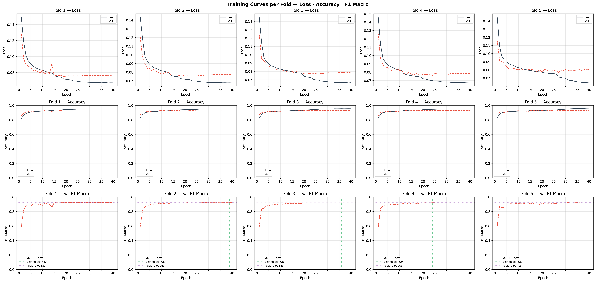
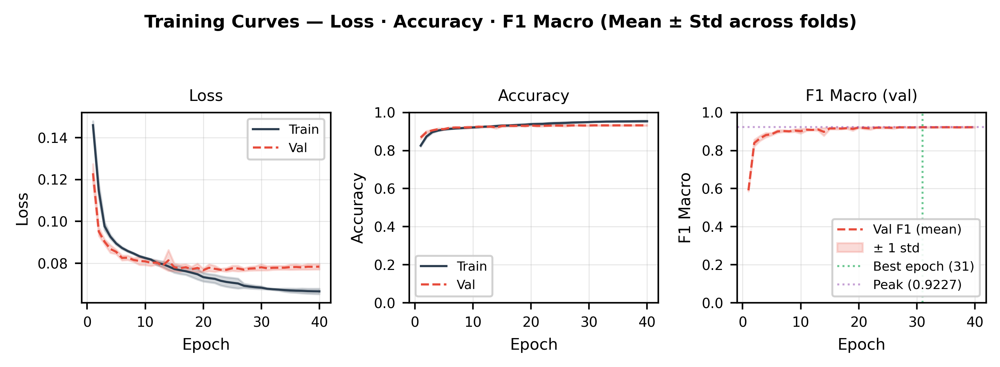
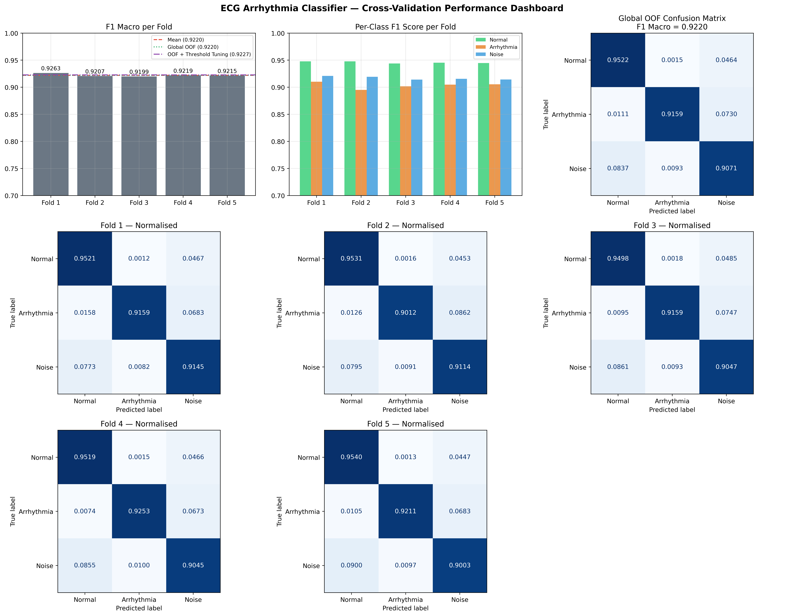
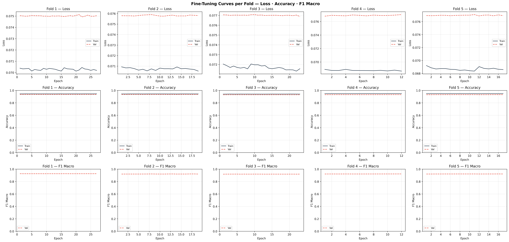
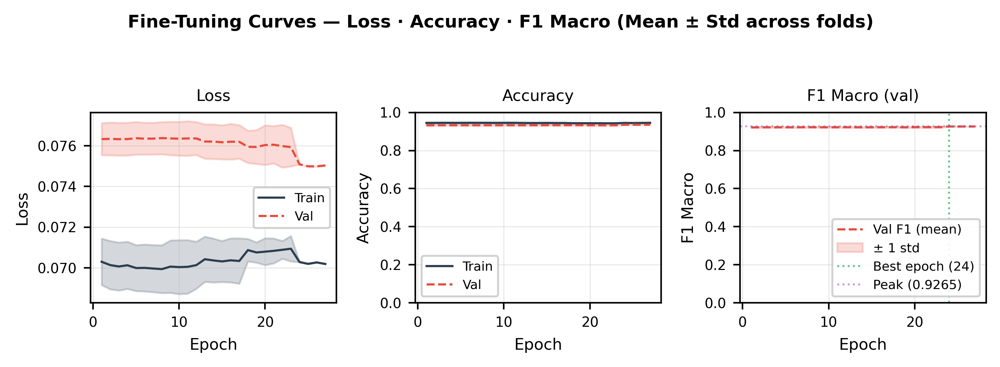
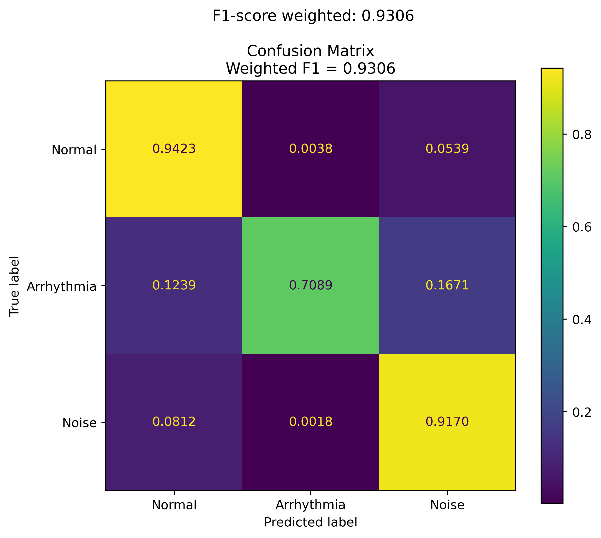
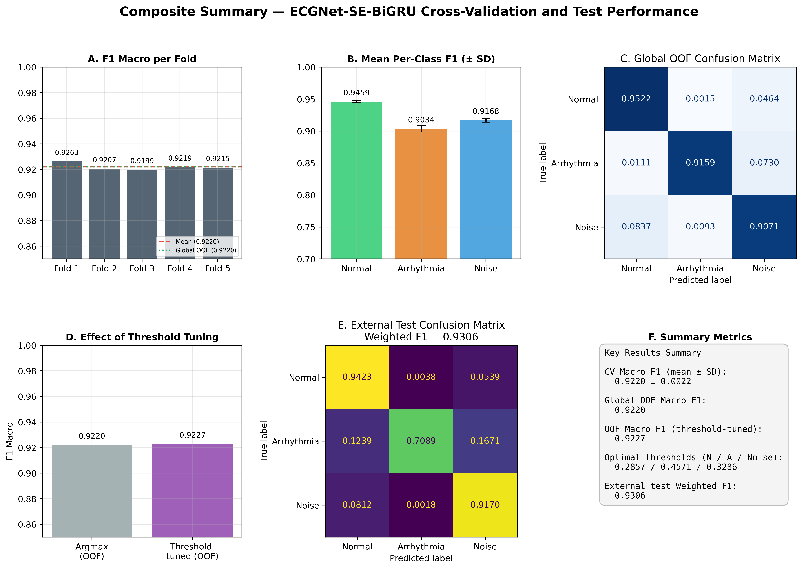

# ECGNet-SE-BiGRU: Squeeze-and-Excitation Attention and Bidirectional Recurrence for Robust Arrhythmia Recognition

A compact, attention-based deep learning model for automatic classification of single-lead ECG segments into **Normal rhythm**, **Arrhythmia**, and **Noise**, trained and evaluated on an intentionally limited subset of the [Icentia11k](https://physionet.org/content/icentia11k-continuous-ecg/1.0/) database to emulate realistic clinical development conditions (limited annotated data and computational resources).

## Associated Manuscript

- **Title:** Squeeze-and-Excitation Attention and Bidirectional Recurrence for Robust Arrhythmia Recognition
- **Authors:** Laura T. Monsalve, Daniel J. Morelos and Carlos A. Fajardo
- **Submitted to:** IEEE Latin America Transactions
- **Manuscript / Submission ID:** []

## Overview

Atrial fibrillation (AF) is one of the most prevalent cardiac arrhythmias and a major risk factor for stroke, heart failure, and mortality. This project implements a lightweight hybrid architecture combining:

- **1D Convolutional layers** for hierarchical morphological feature extraction
- **Squeeze-and-Excitation (SE) attention** for channel-wise feature recalibration
- **Bidirectional GRU** for temporal dependency modeling
- **Focal Loss with label smoothing** to address class imbalance
- **Post-training per-class threshold optimization** to improve minority-class (arrhythmia) detection

The model contains approximately **293,000 trainable parameters**, offering a favorable balance between predictive performance and computational efficiency — suitable for wearable and resource-constrained deployment scenarios.

## Key Results

| Metric | Value |
|---|---|
| OOF Macro F1-score (5-fold CV) | **0.9221 ± 0.0025** |
| F1 — Normal rhythm | 0.9459 ± 0.0018 |
| F1 — Arrhythmia | 0.9034 ± 0.0056 |
| F1 — Noise | 0.9168 ± 0.0030 |
| F1 — Weighted (CV) | 0.9325 ± 0.0022 |
| Accuracy (CV) | 0.9326 ± 0.0022 |
| External test set — Weighted F1-score | **0.9306** |

Results were obtained via stratified 5-fold cross-validation with out-of-fold (OOF) prediction aggregation, followed by evaluation on an independent, patient-level held-out test set (patients not seen during training or validation).

## Result Figures

| Figure | Description |
|---|---|
|  | Loss, accuracy and F1-macro curves per fold |
|  | Loss, accuracy and F1-macro — mean ± std across folds |
|  | 5-fold CV performance dashboard |
|  | Fine-tuning curves per fold |
|  | Fine-tuning — mean ± std across folds |
|  | Confusion matrix on external test set |
|  | Publication-ready summary figure |

PDF versions of all figures are available in [`results/figures/`](results/figures/).

## Dataset

- **Source**: [Icentia11k](https://physionet.org/content/icentia11k-continuous-ecg/1.0/) — one of the largest public single-lead ambulatory ECG databases (~11,000 patients), available via PhysioNet.
- **Subset used**: 116,953 ECG segments (2,049 time steps each) derived from 500 patients, to emulate a realistic, data-constrained development scenario.
- **Preprocessing**: per-sample Z-score normalization along the time axis.

> **Note**: Raw ECG data is not included in this repository due to size and licensing. See [PhysioNet's Icentia11k page](https://physionet.org/content/icentia11k-continuous-ecg/1.0/) for access instructions.

## Architecture

```
Input (2049, 1)
 -> Conv1D(32, k=7)  -> BN -> ReLU -> MaxPool -> Dropout(0.2)
 -> Conv1D(64, k=5)  -> BN -> ReLU -> MaxPool -> Dropout(0.2)
 -> Conv1D(128, k=3) -> BN -> ReLU -> MaxPool -> Dropout(0.2)
 -> Conv1D(256, k=3) -> BN -> ReLU
 -> Squeeze-and-Excitation block (reduction ratio = 8)
 -> Bidirectional GRU(64)
 -> Dense(128, ReLU) -> Dropout(0.5)
 -> Dense(3, Softmax)
```
## Hyperparameters

The table below summarizes the full hyperparameter configuration used for training, fine-tuning, and threshold optimization.

| Hyperparameter | Value |
|---|---|
| Input shape | 2049 × 1 |
| Batch size | 32 |
| Optimizer | AdamW |
| Initial learning rate | 1 × 10⁻³ |
| Weight decay | 0.01 |
| Max epochs (initial training) | 40 |
| LR reduction factor / patience | 0.5 / 3 epochs |
| Minimum learning rate | 1 × 10⁻⁶ |
| Focal loss γ | 3.0 |
| Focal loss α | 1.0 |
| Label smoothing | 0.05 |
| SE reduction ratio | 8 |
| Fine-tuning learning rate | 1 × 10⁻⁵ |
| Fine-tuning epochs (max) | 15 |
| Fine-tuning early-stopping patience | 5 epochs |
| Threshold grid range | 0.20 – 0.80 |
| Threshold grid steps | 15 |
| Random seed | 42 |

## Repository Structure

```
ECG-Arrhythmia-Detection-DMTM/
├── README.md
├── LICENSE
├── requirements.txt
├── .gitignore
├── src/
│   ├── data_preprocessing.py   # HDF5 loading, Z-score normalization
│   ├── model.py                # SE block + ECGNet-SE-BiGRU architecture
│   ├── losses.py                # Focal loss with label smoothing
│   ├── callbacks.py             # Custom Keras callbacks (checkpointing, F1 tracking, history)
│   ├── train.py                 # 5-fold stratified CV training loop
│   ├── evaluate.py              # OOF evaluation, confusion matrices, dashboard
│   └── threshold_optimization.py # Per-class decision threshold grid search
├── notebooks/
│   └── training_pipeline.ipynb  # End-to-end pipeline (Colab-ready)
├── results/
│   ├── figures/                 # Training curves, confusion matrices, dashboard
│   └── metrics.json             # Fold-level and global metrics
└── docs/
    └── paper_draft.md           # Manuscript draft (methods, results, discussion)
```

## Installation

```bash
git clone https://github.com/DanielMorelos/ECG-Arrhythmia-Detection-DMTM.git
cd ECG-Arrhythmia-Detection-DMTM
pip install -r requirements.txt
```

## Usage

Run the pipeline in order — each script consumes artifacts produced by the previous one.

```bash
# 1. Train the 5-fold cross-validation models
python src/train.py \
  --train-data path/to/training_set.h5 \
  --test-data path/to/test_set.h5 \
  --checkpoint-dir path/to/checkpoints/

# 2. Reload checkpoints, fine-tune, and rebuild the OOF ensemble
python src/evaluate.py \
  --train-data path/to/training_set.h5 \
  --test-data path/to/test_set.h5 \
  --checkpoint-dir path/to/checkpoints/

# 3. Optimize per-class decision thresholds and generate final predictions
python src/threshold_optimization.py \
  --checkpoint-dir path/to/checkpoints/ \
  --output-path path/to/final_predictions.npy
```

> Paths in the original development notebook pointed to Google Drive (Colab environment). The modularized scripts in `src/` accept paths as command-line arguments instead.

### Pipeline artifacts

| Stage | Script | Key outputs (in `--checkpoint-dir`) |
|---|---|---|
| Training | `train.py` | `best_model_fold_{i}.keras`, `history_fold_{i}.json`, `resume_weights_fold_{i}.weights.h5` |
| Evaluation & fine-tuning | `evaluate.py` | `best_model_fold_{i}_finetuned.keras`, `history_fold_{i}_finetuned.json`, `training_curves.png`, `performance_dashboard.png`, `oof_prob_matrix.npy`, `oof_true_labels.npy`, `ensemble_test_probs.npy` |
| Threshold optimization | `threshold_optimization.py` | `final_predictions.npy` |

## Methodology Summary

1. **Cross-validation**: Stratified 5-fold CV (random_state=42), preserving class proportions across folds.
2. **Loss function**: Multiclass focal loss (γ = 3.0, α = 1.0) with label smoothing (ε = 0.05) to address class imbalance and reduce overconfidence.
3. **Optimization**: AdamW (lr=0.001, weight_decay=0.01), max 40 epochs, batch size 32, ReduceLROnPlateau (factor 0.5, patience 3), EarlyStopping on validation loss.
4. **Fine-tuning**: Last 3 layers unfrozen and fine-tuned for up to 15 epochs at a reduced learning rate (1e-5).
5. **Threshold optimization**: Grid search over per-class decision thresholds (0.20–0.80) on OOF probabilities to maximize macro F1-score.
6. **Final inference**: Soft-voting ensemble across the five fold-specific (fine-tuned) models, followed by optimized threshold decoding.

## Citation

If you use this work, please cite the associated manuscript (citation details to be added upon publication).

## References

1. T. Tuncer, S. Dogan, P. Pławiak, and U. R. Acharya, "Automated arrhythmia detection using novel hexadecimal local pattern and multilevel wavelet transform with ECG signals," *Knowledge-Based Systems*, vol. 186, p. 104923, Aug. 2019, doi: [10.1016/j.knosys.2019.104923](https://doi.org/10.1016/j.knosys.2019.104923).
2. G. Yao et al., "Interpretation of electrocardiogram heartbeat by CNN and GRU," *Computational and Mathematical Methods in Medicine*, vol. 2021, pp. 1–10, Aug. 2021, art. no. 6534942, doi: [10.1155/2021/6534942](https://doi.org/10.1155/2021/6534942).
3. M. Guhdar, A. O. Mohammed, and R. J. Mstafa, "Advanced deep learning framework for ECG arrhythmia classification using 1D-CNN with attention mechanism," *Knowledge-Based Systems*, vol. 315, p. 113301, Mar. 2025, doi: [10.1016/j.knosys.2025.113301](https://doi.org/10.1016/j.knosys.2025.113301).
4. M. Kolhar, R. N. A. Kazi, H. Mohapatra, and A. M. A. Rajeh, "AI-driven real-time classification of ECG signals for cardiac monitoring using i-AlexNet architecture," *Diagnostics*, vol. 14, no. 13, p. 1344, Jun. 2024, doi: [10.3390/diagnostics14131344](https://doi.org/10.3390/diagnostics14131344).
5. C. A. Fajardo, A. S. Parra, and T. V. Castellanos-Parada, "Lightweight deep learning for atrial fibrillation detection: Efficient models for wearable devices," *Ingeniería e Investigación*, vol. 45, no. 1, p. e114530, Jun. 2025, doi: [10.15446/ing.investig.114530](https://doi.org/10.15446/ing.investig.114530).
6. Mohebbanaaz, L. Kumar, and Y. Padma Sai, "A new transfer learning approach to detect cardiac arrhythmia from ECG signals," *Signal, Image and Video Processing*, vol. 16, 2022, doi: [10.1007/s11760-022-02155-w](https://doi.org/10.1007/s11760-022-02155-w).
7. Q. Zou, S. Xie, Z. Lin, M. Wu, and Y. Ju, "Finding the best classification threshold in imbalanced classification," *Big Data Research*, vol. 5, pp. 2–8, Jan. 2016, doi: [10.1016/j.bdr.2015.12.001](https://doi.org/10.1016/j.bdr.2015.12.001).
8. S. Tan, S. Ortiz-Gagné, N. Beaudoin-Gagnon, P. Fecteau, A. Courville, Y. Bengio, and J. P. Cohen, "Icentia11k Single Lead Continuous Raw Electrocardiogram Dataset (version 1.0)," 2022, PhysioNet, RRID:SCR_007345, doi: [10.13026/kk0v-r952](https://doi.org/10.13026/kk0v-r952).
9. M. S. Islam, K. F. Hasan, S. Sultana, S. Uddin, P. Lió, J. M. W. Quinn, and M. A. Moni, "HARDC: A novel ECG-based heartbeat classification method to detect arrhythmia using hierarchical attention based dual structured RNN with dilated CNN," *Neural Networks*, vol. 162, pp. 271–287, May 2023, doi: [10.1016/j.neunet.2023.03.004](https://doi.org/10.1016/j.neunet.2023.03.004).
10. J. Hu, L. Shen, and G. Sun, "Squeeze-and-excitation networks," in *Proc. IEEE Conf. Comput. Vis. Pattern Recognit. (CVPR)*, Salt Lake City, UT, USA, 2018, pp. 7132–7141, doi: [10.1109/CVPR.2018.00745](https://doi.org/10.1109/CVPR.2018.00745).
11. K. Cho, B. van Merriënboer, C. Gulcehre, D. Bahdanau, F. Bougares, H. Schwenk, and Y. Bengio, "Learning phrase representations using RNN encoder–decoder for statistical machine translation," in *Proc. Conf. Empirical Methods in Natural Language Processing (EMNLP)*, Doha, Qatar, 2014, pp. 1724–1734, doi: [10.3115/v1/D14-1179](https://doi.org/10.3115/v1/D14-1179).
12. T. Romdhane, H. Alhichri, R. Ouni, and M. Atri, "Electrocardiogram heartbeat classification based on a deep convolutional neural network and focal loss," *Computers in Biology and Medicine*, vol. 123, p. 103866, 2020, doi: [10.1016/j.compbiomed.2020.103866](https://doi.org/10.1016/j.compbiomed.2020.103866).
13. T.-Y. Lin, P. Goyal, R. Girshick, K. He, and P. Dollár, "Focal loss for dense object detection," in *Proc. IEEE Int. Conf. Comput. Vis. (ICCV)*, Venice, Italy, 2017, pp. 2980–2988, doi: [10.1109/ICCV.2017.324](https://doi.org/10.1109/ICCV.2017.324).
14. S. Gupta, N. Panwar, and P. Roy, "HeartBeatAI: An interpretable and robust deep learning framework for multi-label ECG arrhythmia detection," 2026, doi: [10.48550/arXiv.2605.24588](https://doi.org/10.48550/arXiv.2605.24588).
15. C. Szegedy, V. Vanhoucke, S. Ioffe, J. Shlens, and Z. Wojna, "Rethinking the inception architecture for computer vision," in *Proc. IEEE Conf. Comput. Vis. Pattern Recognit. (CVPR)*, 2016, pp. 2818–2826, doi: [10.1109/CVPR.2016.308](https://doi.org/10.1109/CVPR.2016.308).
16. A. Y. Hannun, P. Rajpurkar, M. Haghpanahi et al., "Cardiologist-level arrhythmia detection and classification in ambulatory electrocardiograms using a deep neural network," *Nature Medicine*, vol. 25, no. 1, pp. 65–69, Jan. 2019, doi: [10.1038/s41591-018-0268-3](https://doi.org/10.1038/s41591-018-0268-3).
17. A. H. Ribeiro, M. H. Ribeiro, G. M. M. Paixão et al., "Automatic diagnosis of the 12-lead ECG using a deep neural network," *Nature Communications*, vol. 11, no. 1, p. 1760, Apr. 2020, doi: [10.1038/s41467-020-15432-4](https://doi.org/10.1038/s41467-020-15432-4).
18. N. Strodthoff, P. Wagner, T. Schaeffter, and W. Samek, "Deep learning for ECG analysis: Benchmarks and insights from PTB-XL," *IEEE Journal of Biomedical and Health Informatics*, vol. 25, no. 5, pp. 1519–1528, May 2021, doi: [10.1109/JBHI.2020.3022989](https://doi.org/10.1109/JBHI.2020.3022989).
19. M. Kachuee, S. Fazeli, and M. Sarrafzadeh, "ECG heartbeat classification: A deep transferable representation," in *Proc. 2018 IEEE Int. Conf. on Healthcare Informatics (ICHI)*, 2018, pp. 443–444, doi: [10.1109/ICHI.2018.00092](https://doi.org/10.1109/ICHI.2018.00092).
20. X. Bai, X. Dong, Y. Li, R. Liu, and H. Zhang, "A hybrid deep learning network for automatic diagnosis of cardiac arrhythmia based on 12-lead ECG," *Scientific Reports*, vol. 14, no. 1, p. 2441, Oct. 2024, doi: [10.1038/s41598-024-75531-w](https://doi.org/10.1038/s41598-024-75531-w).
21. D. J. Morelos and L. T. Monsalve, "ECG-Arrhythmia-Detection-DMTM," GitHub repository, 2026. [Online]. Available: https://github.com/DanielMorelos/ECG-Arrhythmia-Detection-DMTM
## License

This project is licensed under the MIT License — see [LICENSE](LICENSE) for details.
